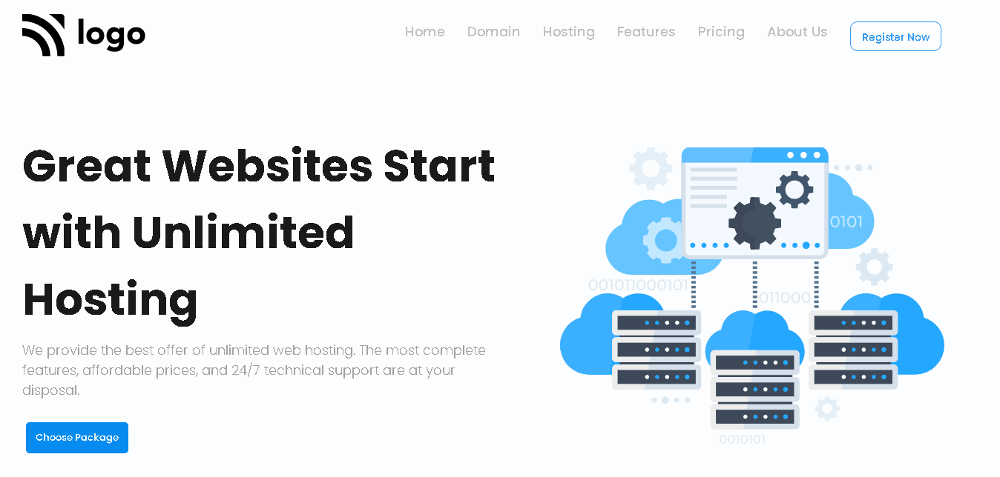

# Assignment-11

# Project [Deployed Link](https://deepakproject11.netlify.app)

- What I learned from this Project?
  - 
  - Learned how to make hosting landing page.
  - Learned how to make button and reuse them. 
  - Learned about making Testimonial Cards.
  - Created price section as well as banner and beautiful footer.
  - How to use different Google Fonts in webpage.
  - Learned how to make responsive web-design.
  
  

 
---

## Time taken to finish this project

- 10 hour to complete it.

---

## ScreenShot

